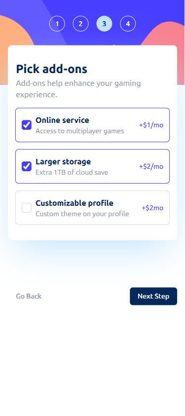

# Frontend Mentor - Multi-step form solution

This is a solution to the [Multi-step form challenge on Frontend Mentor](https://www.frontendmentor.io/challenges/multistep-form-YVAnSdqQBJ). Frontend Mentor challenges

## Table of contents

- [Overview](#overview)
  - [The challenge](#the-challenge)
  - [Screenshot](#screenshot)
  - [Links](#links)
- [My process](#my-process)
  - [Built with](#built-with)
  - [What I learned](#what-i-learned)
  - [Continued development](#continued-development)
  - [Useful resources](#useful-resources)
- [Author](#author)
- [Acknowledgments](#acknowledgments)

**Note: Delete this note and update the table of contents based on what sections you keep.**

## Overview

### The challenge

Users should be able to:

- Complete each step of the sequence
- Go back to a previous step to update their selections
- See a summary of their selections on the final step and confirm their order
- View the optimal layout for the interface depending on their device's screen size
- See hover and focus states for all interactive elements on the page
- Receive form validation messages if:
  - A field has been missed
  - The email address is not formatted correctly
  - A step is submitted, but no selection has been made

### Screenshot

### Links

- Solution URL: [You can see my solution here](https://www.frontendmentor.io/solutions/multistepform-using-reacthookform-and-zod-validation-GG7e9IVwGe)
- Live Site URL: [Multi-step-form](https://multi-step-form-bhfc278zr-creedyfish.vercel.app/)

## My process

### Built with

- Semantic HTML5 markup

- Flexbox
- CSS Grid
- Mobile-first workflow
- [React](https://reactjs.org/) - JS library
- [Next.js](https://nextjs.org/) - React framework
- [Tailwind CSS](https://tailwindcss.com/) - CSS framework

### What I learned

I learned to use react hook form and zod validation for the inputs.
code is scuffed because it took me about 2 days to do step 3 with the checkboxes.
it would have been fine if I only took the names of the checkboxes but I also had to consider the prices of
each boxes based on the choice in step2 so that means I have to create an array of objects and unfortunatley
inputs cannot set objects as their value. Unless I am wrong, Please do provide some info on how to do that.
I have been at this for at least 2 weeks so this challenge really beat the crap out of me.

My codes almost brute forces some codes because of type validation in typescript since it was my first time trying out react hook form and zod.
Overall I had a great time.

### Continued development

I would really need more practice with logical architecture and types since that has been one of the problems that I haev kept
encountering using typescript and I should use ":any" less often for the props in my arguments.

### Useful resources

- [React hook form](https://react-hook-form.com/) - This helped me for react hook form. Documentation is a little bit hard to understand for beginners luckily the creator has a youtube channel that have tutotials of this package.

## Author

- Website - [Irvin Elbanbuena](https://port-web-brown.vercel.app/)
- Frontend Mentor - [@Creedyfish](https://www.frontendmentor.io/profile/Creedyfish)

## Acknowledgments

Big shout to to Codevolution for react hook form tutorials
[Codevolution](https://www.youtube.com/@Codevolution)
